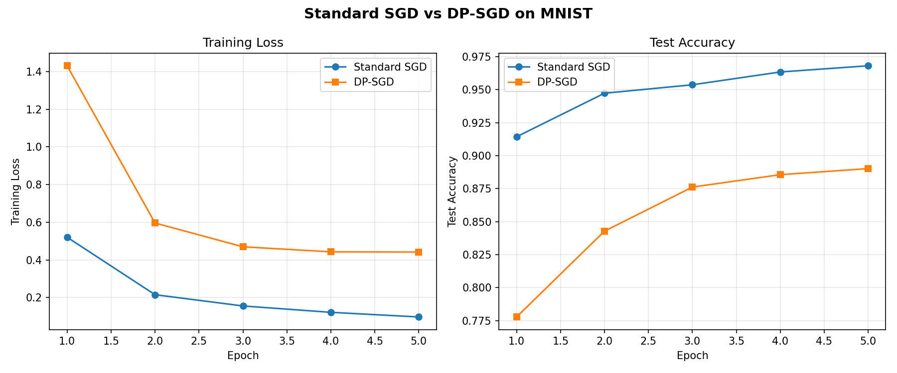

# Deep Learning with Differential Privacy — MNIST Comparison

This repository implements and compares **standard SGD** against **Differentially-Private SGD (DP-SGD)** on the MNIST handwritten digit classification task, based on the algorithm described in:

> Abadi, M., Chu, A., Goodfellow, I., McMahan, H.B., Mironov, I., Talwar, K. and Zhang, L., 2016. *Deep learning with differential privacy.* In Proceedings of the 2016 ACM SIGSAC Conference on Computer and Communications Security (CCS '16).

The included PDF (`DeepLearningWithDifferentialPrivacy.pdf`) is the original paper.

---

## Repository Structure

```
.
├── model.py              # Neural network class with standard and DP-SGD backprop
├── compare.py            # Script to train both models and compare results
├── requirements.txt      # Python dependencies
├── results.png           # Generated plot (loss and accuracy curves)
├── DeepLearningWithDifferentialPrivacy.pdf  # Original paper
├── data/                 # MNIST dataset (auto-downloaded on first run)
└── README.md             # This file
```

### File Details

- **`model.py`** — Contains the `DPNeuralNetwork` class. This is the core of the project. The class wraps a feed-forward neural network and supports two backpropagation modes selected at construction time:
  - `backprop_type="standard"` — vanilla mini-batch SGD
  - `backprop_type="dp"` — DP-SGD (Algorithm 1 from the paper), with per-example gradient clipping, Gaussian noise injection, and RDP-based privacy accounting
- **`compare.py`** — Trains one standard model and one DP model with matched hyperparameters, prints a results table, computes the DP model's (epsilon, delta) privacy cost, and saves loss/accuracy plots to `results.png`.
- **`requirements.txt`** — Lists the four dependencies: `torch`, `torchvision`, `numpy`, `matplotlib`.

---

## How Our Implementation Differs from the Paper

| Aspect | Paper (Abadi et al., 2016) | Our Implementation |
|---|---|---|
| **Framework** | TensorFlow | PyTorch |
| **Architecture** | 784-1000-1000-10 (two hidden layers, 1000 units each) | 784-256-128-10 (two hidden layers, 256 and 128 units) — smaller for faster experimentation |
| **Per-example gradients** | Exploits TensorFlow's per-example gradient API for efficient batched computation | Loops over individual examples in each mini-batch — slower but straightforward and easy to follow |
| **Mini-batch sampling** | Poisson subsampling: each example included independently with probability L/N | Uses PyTorch's `DataLoader` with `shuffle=True` and fixed batch size — an approximation of Poisson sampling that is standard in practice |
| **Privacy accountant** | Moments accountant (a novel contribution of the paper) | RDP (Rényi Differential Privacy) accountant — a later generalization by Mironov (2017) that subsumes the moments accountant and gives equivalent or tighter bounds |
| **Training scale** | 60 epochs on full MNIST, also tested on CIFAR-10 with CNNs | 5 epochs on MNIST with a smaller fully-connected network, focused on demonstrating the core algorithm |
| **Optimizer** | SGD with fixed learning rate | SGD with fixed learning rate (matching the paper's approach) |

### Key simplifications we made and why

1. **Smaller network**: The paper's 784-1000-1000-10 architecture has ~1.8M parameters. Ours has ~235K. This keeps DP-SGD training tractable on CPU since we compute per-example gradients via a loop.

2. **No Poisson sampling**: True Poisson subsampling (each example drawn independently with probability L/N) produces variable-size batches. We use fixed-size shuffled batches instead, which is what most practical DP-SGD implementations do (including Google's `dp-accounting` library and Opacus). The privacy analysis still holds with minor adjustments.

3. **RDP instead of moments accountant**: The moments accountant was a key contribution of the paper, but it has since been generalized by RDP. Our RDP implementation computes the same (or tighter) privacy bounds and is the current standard approach for DP accounting.

4. **Fewer epochs**: We train for 5 epochs rather than 60 to keep the demo practical. More epochs would improve DP accuracy but also increase the privacy budget.

---

## How to Run

### Prerequisites

- Python 3.10+
- pip

### Setup

```bash
# Clone the repository
git clone <repo-url>
cd Deep-Learning-With-Differential-Privacy

# Install dependencies
pip install -r requirements.txt
```

### Run the comparison

```bash
python3 compare.py
```

This will:
1. Download the MNIST dataset to `./data/` (first run only, ~12 MB)
2. Train a standard SGD model for 5 epochs
3. Train a DP-SGD model for 5 epochs
4. Print a results summary table to the terminal
5. Save loss/accuracy curves to `results.png`

Expected runtime: ~7 minutes on CPU (standard SGD is fast; DP-SGD is slower due to per-example gradient computation).

### Customizing hyperparameters

Edit the constants at the top of `compare.py`:

```python
EPOCHS = 5          # Number of training epochs
LR = 0.1            # Learning rate
BATCH_SIZE = 256    # Mini-batch / lot size L

# DP-specific
NOISE_SCALE = 1.1   # Noise multiplier sigma
CLIP_BOUND = 1.0    # Per-example gradient norm bound C
DELTA = 1e-5        # Target delta for (epsilon, delta)-DP
```

Increasing `NOISE_SCALE` gives stronger privacy (lower epsilon) at the cost of accuracy. Decreasing `CLIP_BOUND` clips gradients more aggressively, which also reduces accuracy but is necessary for bounding sensitivity.

---

## Results

### Summary Table

| Model | Final Train Loss | Final Test Accuracy | Total Training Time |
|---|---|---|---|
| Standard SGD | 0.0971 | **96.81%** | 51.9 s |
| DP-SGD | 0.4418 | **89.02%** | 365.4 s |

**DP-SGD privacy cost**: epsilon = 1.23, delta = 1e-5

Parameters: noise_scale = 1.1, clip_bound = 1.0, batch_size = 256, 5 epochs.

### Per-Epoch Breakdown

| Epoch | Standard Loss | Standard Acc | DP Loss | DP Acc |
|---|---|---|---|---|
| 1 | 0.5204 | 91.43% | 1.4308 | 77.78% |
| 2 | 0.2153 | 94.73% | 0.5959 | 84.28% |
| 3 | 0.1555 | 95.37% | 0.4696 | 87.62% |
| 4 | 0.1217 | 96.34% | 0.4429 | 88.56% |
| 5 | 0.0971 | 96.81% | 0.4418 | 89.02% |

### Loss and Accuracy Curves



---

## Key Takeaways

1. **Privacy has a cost**: DP-SGD achieves 89.02% accuracy compared to 96.81% for standard SGD — a gap of about 7.8 percentage points. This is the fundamental accuracy-privacy tradeoff in differential privacy.

2. **The privacy guarantee is meaningful**: An epsilon of 1.23 with delta = 1e-5 means that for any single training example, an adversary observing the trained model cannot distinguish (with high confidence) whether that example was in the training set or not. This is a strong formal guarantee.

3. **DP-SGD is slower**: The per-example gradient computation makes DP-SGD roughly 7x slower than standard SGD in our loop-based implementation. Production implementations (e.g., Opacus) use vectorized per-example gradients to close much of this gap.

4. **Gradient clipping and noise are both necessary**: Clipping bounds the sensitivity of each example's contribution (so no single example can dominate), while the Gaussian noise masks the contribution of any individual example. Together, they provide the differential privacy guarantee.

5. **More training helps but costs privacy**: Each additional epoch improves accuracy but increases the cumulative privacy budget (epsilon). The RDP accountant tracks this accumulation across all steps.
